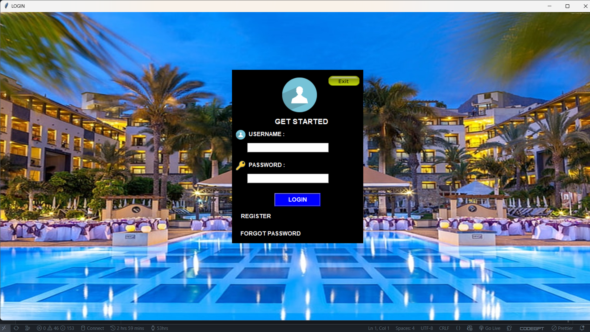

<!-- ALL-CONTRIBUTORS-BADGE:START - Do not remove or modify this section -->

<!-- ALL-CONTRIBUTORS-BADGE:END -->
<p align="center">
    <a href="https://tryshape.vercel.app/" target="_blank">
        
    </a>

</p>
<p align="center">
<!--  -->
<h1 align="center">Suitespot</h1>

<p align="center">
<a href="https://github.com/iamAntimpal/Suitespot/blob/master/LICENSE" target="blank">

</a>
<a href="https://github.com/iamAntimpal/Suitespot/fork" target="blank">

</a>
<a href="https://github.com/iamAntimpal/Suitespot/stargazers" target="blank">

</a>
<a href="https://github.com/iamAntimpal/Suitespot/issues" target="blank">

</a>
<a href="https://github.com/iamAntimpal/Suitespot/pulls" target="blank">

</a>


</p>

<p align="center">
    <a href="" target="blank">View Demo</a>
    ·
    <a href="https://github.com/iamAntimpal/Suitespot/issues/new/choose">Report Bug</a>
    ·
    <a href="https://github.com/iamAntimpal/Suitespot/issues/new/choose">Request Feature</a>
</p>

# 👋 Introducing `Suitespot`

<p align="center">
    <a href="" target="blank"/>
        
    </a>
</p>

`Suitespot` is an opensource platform to booking hotel management system. It is a windows-based software that allows you to manage your hotel's bookings, rooms, and other aspects of your business. It is designed to be user-friendly and efficient, making it easy for you to manage your hotel's operations from anywhere.

# 🚀 Demo

Here is a quick demo of the app. We hope you enjoy it.

<!-- > [The Demo Link](https://www.youtube.com) -->

Liked it? Please give a ⭐️ to <b>Suitespot</b> to build its triceps 💪 stronger.

### Many Thanks to all the `Stargazers` who has supported this project with stars(⭐)

<!-- [](https://github.com/TryShape/tryshape/stargazers) -->

# 💻 Use Suitespot

Please access Suitespot using the URL:

> [how to use link](https://github.com/iamAntimPal/SuiteSpot/blob/main/HOWTOUSE.md)

# 🔥 Features
`Suitespot` comes with a bundle of features already. You can do the followings with it,

- Booking Management
- Room Management
- Customer Management
- Payment Management
- Invoice Management
- Report Management
- etc.

# 📦 Installation
To install Suitespot, you can use the following command:
```bash
# Clone the repository
git clone https://github.com/iamAntimpal/Suitespot.git
# Navigate to the repository directory
cd Suitespot
# Install the required dependencies
pip install -r requirements.txt
# Run the application
python login.py
```

# 🍔 Built With

| Language / Tech       | Description                         | Version Used      |
| --------------------- | ----------------------------------- | ----------------- |
| 🐍 Python             | Core programming language           | 3.10+             |
| 🖼️ Tkinter           | GUI framework (Python standard lib) | Built-in (3.10+)  |
| 🗃️ SQLite            | Lightweight embedded database       | 3.31+             |
| 🧪 Pytest             | Unit testing framework              | ^7.0              |
| 🎨 ttk / ttkbootstrap | Themed widgets for enhanced UI      | Optional / latest |
| 🧰 Git & GitHub       | Version control & collaboration     | Git 2.30+         |
| ⚙️ GitHub Actions     | CI/CD automation                    | YAML-based        |
| 📋 Flake8 + Black     | Code linting & formatting           | ^6.1 / ^23.0      |
| 📦 PyInstaller        | Packaging desktop app               | ^5.13             |

# 🛡️ License

This project is licensed under the MIT License - see the [`LICENSE`](LICENSE) file for details.

# 🦄 Upcoming Features

`Suitespot` has all the potentials to grow further. Here are some of the upcoming features planned(not in any order),

- ✔️ Dashboard
- ✔️ Analysis about data in Hotel
- ✔️ 
- ✔️ 


# 🤝 Contributing to `Suitespot`

Any kind of positive contribution is welcome! Please help us to grow by contributing to the project.

If you wish to contribute, you can work on any features [listed here](https://github.com/iamAntimPal/Suitespot/#-upcoming-features) or create one on your own. After adding your code, please send us a Pull Request.

> Please read [`CONTRIBUTING`](CONTRIBUTING.md) for details on our [`CODE OF CONDUCT`](CODE_OF_CONDUCT.md), and the process for submitting pull requests to us.

# 🙏 Support

We all need support and motivation. `Suitespot` is window based software. Please give this project a ⭐️ to encourage and show that you liked it. Don't forget to leave a star ⭐️ before you move away.

If you found the app helpful, consider supporting us with a coffee.

<a href="https://buymeacoffee.com/antimpal01l">
    
</a>

---

<h3 align="center">
A ⭐️ to <b>SuiteSpot</b> is to build its triceps 💪 stronger.
</h3>

<!-- ## Contributors ✨ -->


<!-- markdownlint-restore -->
<!-- prettier-ignore-end -->

<!-- ALL-CONTRIBUTORS-LIST:END -->
